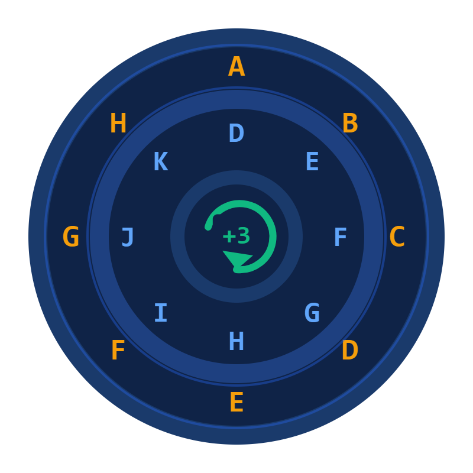
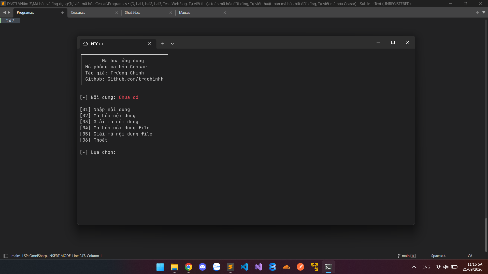

# TRIỂN KHAI MÃ HÓA CEASAR BẰNG C#

<p align="center">
  
</p>

<p align="center">
  <a href="https://github.com/trgchinhh">
    
  </a>
  <a href="LICENSE">
    
  </a>
  <a href="https://github.com/trgchinhh">
    
  </a>
</p>

Chương trình nhỏ mô phỏng thuật toán mã hóa Ceasar (dịch chuyển ký tự) tự build



---

## Giới thiệu

- **Mã hóa Ceasar:** là thuật toán mã hóa cổ điển đơn giản nhất, do Hoàng đế La Mã Julius Caesar sáng tạo
  - Nguyên tắc: mỗi ký tự trong bản rõ được thay thế bằng ký tự đứng sau nó k vị trí trong bảng chữ cái
  - Mã hóa thì dịch tiến, giải mã thì dịch lùi đúng số vị trí đó
  - Chỉ cần 1 khóa k nhưng kết quả luôn đúng theo chiều ngược lại
  - => Mỗi ký tự bị thay bằng ký tự khác theo một quy luật cố định, chỉ người có khóa k mới biết quy luật
  - => Vì dùng 1 khóa cho 2 chiều mã hóa và giải mã nên đây cũng là 1 loại mã hóa đối xứng (dùng 1 khóa)

- **Hàm băm (hash):** là khái niệm 1 chiều, độ dài không đổi tùy thuật toán sẽ cho ra độ dài cố định khác nhau
  - Dùng để kiểm tra tính toàn vẹn dữ liệu (so hash bản rõ và bản rõ sau giải mã)

---

## Thành phần

- `P`: nội dung (bản rõ)
- `C`: nội dung sau mã hóa (bản mã)
- `k`: khóa mã (số vị trí dịch chuyển mỗi ký tự)
- `n`: kích thước bảng ký tự (chữ thường 26, chữ hoa 26, số 10)

---

## Các phép biến đổi

- `mod`: phép chia lấy dư (%)
- `dịch chuyển vòng`: ký tự khi vượt quá cuối bảng sẽ quay ngược về đầu bảng

---

## Công thức mã hóa

```
C = (P + k) mod n
```

- Dịch ký tự P tiến k vị trí trong bảng

```
[*] Công thức chung: C = (P + k) mod n
```

---

## Công thức giải mã

```
P = (C - k) mod n
```

- Dịch ký tự C lùi k vị trí trong bảng

```
[*] Công thức chung: P = (C - k) mod n
```

---

## Quá trình

- Nhập khóa k trong khoảng 0 -> 25
- Quá trình mã hóa dùng khóa k để dịch ký tự tiến lên
- Quá trình giải mã dùng chính khóa k để dịch ký tự lùi lại
- Chữ thường và chữ hoa được dịch trên bảng riêng của mình
- Chữ số được dịch trên bảng 10 ký tự riêng
- Ký tự đặc biệt (dấu cách, chấm, phẩy...) giữ nguyên
- Sau khi giải mã có thể dùng SHA-256 để kiểm tra nội dung trước và sau có giống nhau hay không

---

## Ví dụ

```
Bản rõ P = "HELLO"
Khóa: k = 3

Mã hóa:
  C[i] = (P[i] + 3) mod 26
  H -> K
  E -> H
  L -> O
  L -> O
  O -> R
  C = "KHOOR"

Giải mã:
  P[i] = (C[i] - 3) mod 26
  K -> H
  H -> E
  O -> L
  O -> L
  R -> O
  P = "HELLO"
  -> Nội dung sau khi giải mã quay trở lại đúng bản rõ ban đầu
```

---

## Đút kết

- Ceasar chỉ dùng 1 khóa duy nhất nên được gọi là mã hóa đối xứng
- Khóa k vừa dùng để mã hóa vừa dùng để giải mã
- Đặc điểm đơn giản, dễ cài đặt nhưng kém an toàn vì chỉ có nhiều nhất 26 trường hợp khóa cần thử để phá mã

> Với công thức là k với k là số vị trí dịch chuyển của khóa
> VD: dùng khóa k = 3 thì chỉ cần thử tối đa 26 khóa là tìm ra bản rõ

```
        MÃ HÓA     │     GIẢI MÃ
     ──────────────┼───────────────
      - khóa k     │    - khóa k
      - bản rõ P   │    - bản mã C
      - (P+k) mod n│    - (C-k) mod n
      - ra C       │    - ra P
```

---

## Cách cài đặt

```bash
git clone https://github.com/trgchinhh/Ceasar-encryption.git
cd .\Ceasar-encryption
dotnet run
```

---

## Tác giả
**Nguyễn Trường Chinh (NTC++)**<br>
**GitHub:** [https://github.com/trgchinhh](https://github.com/trgchinhh)

---

> 📌 Dự án nhỏ được phát triển với mục đích học tập và nghiên cứu. Mọi góp ý và đóng góp đều được hoan nghênh.
